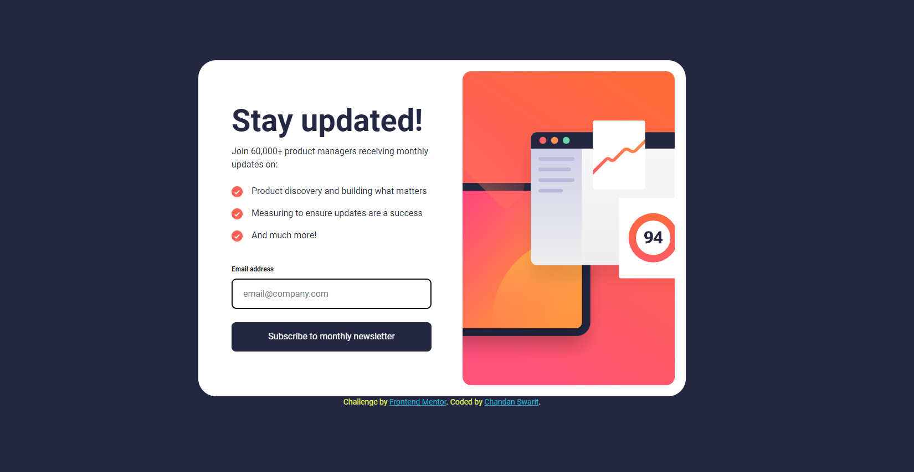
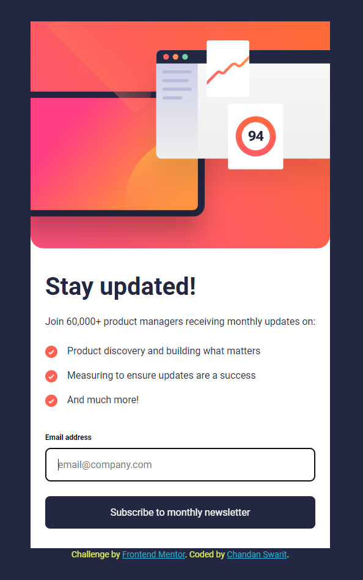

# Frontend Mentor - Newsletter sign-up form with success message solution

This is a solution to the [Newsletter sign-up form with success message challenge on Frontend Mentor](https://www.frontendmentor.io/challenges/newsletter-signup-form-with-success-message-3FC1AZbNrv). Frontend Mentor challenges help you improve your coding skills by building realistic projects. 

## Table of contents

- [Overview](#overview)
  - [The challenge](#the-challenge)
  - [Screenshot](#screenshot)
  - [Links](#links)
- [My process](#my-process)
  - [Built with](#built-with)
  - [What I learned](#what-i-learned)
  - [Useful resources](#useful-resources)
- [Author](#author)

## Overview

### The challenge

Users should be able to:

- Add their email and submit the form
- See a success message with their email after successfully submitting the form
- See form validation messages if:
  - The field is left empty
  - The email address is not formatted correctly
- View the optimal layout for the interface depending on their device's screen size
- See hover and focus states for all interactive elements on the page

### Screenshot




### Links

- Live Site URL: [View Live Site](https://newsletter-frontend-mentor-five.vercel.app/)

## My process

### Built with

- Semantic HTML5 markup
- CSS custom properties
- Flexbox
- CSS Grid
- Mobile-first workflow

### What I learned

- Learned how to create responsive, accessible form layouts using semantic HTML elements and organized CSS for consistent design across different screen sizes.

- Enhanced my understanding of how to handle form submissions and validate email inputs in JavaScript, ensuring user data is in the correct format before processing.

- Gained insights into providing clear feedback to users through error states and success messages, improving the overall UX by making the form more interactive and user-friendly.

- Applied mobile-first design principles, ensuring the newsletter form and success message display properly on smaller devices while adapting effectively to larger screens with media queries.

- Improved my knowledge of using Git for version control, including creating branches, making commits, and pushing code to a remote repository on GitHub.

Some code snippets that were a challenge:

```css
.signup-form ul li {
  color: var(--dark-grey);
  list-style-type: none;
  padding-bottom: 1rem;
  text-indent: -2.25rem;
  margin-left: 2.25rem;
}

.signup-form li::before {
  content: '';
  display: inline-block;
  width: 20px;
  height: 20px;
  background-image: url(../assets/images/icon-list.svg);
  background-size: contain;
  vertical-align: middle;
  margin-right: 1rem;
}

```
```js
  if (emailError) {
    const emailErrorElement = form.querySelector('#email-error');
    const emailErrorColor = document.getElementById('email');
    emailErrorElement.innerText = emailError;
    emailErrorColor.classList.add('error-state');
  } else {
    const successMessageElement = document.querySelector('.success-message');
    const container = document.querySelector('.form-container');
    const emailText = document.querySelector('.success-message .email-text');
    container.style.display = 'none';
    successMessageElement.style.display = 'block';
    emailText.innerText = email;
    emailErrorColor.classList.remove('error-state');
  }
```

### Useful resources

- [MDN Web Docs](https://developer.mozilla.org/en-US/) - MDN Web Docs is the best way to gain knowledge about various styling properties and javascript realted concepts that you probably did not know existed.
- [ChatGPT](https://chatgpt.com/) - GPT helped me get past various roadblocks, especially in styling the components.

## Author

- Chandan Swarit
- Frontend Mentor - [MChandanSwarit](https://www.frontendmentor.io/profile/MChandanSwarit)
